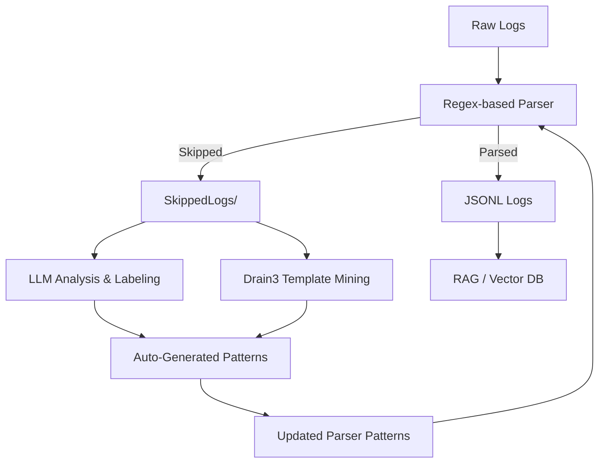

# 🧭 Adaptive Log Parser System with LLM-Driven Intelligence

A smart log processing pipeline where logs — regardless of source, structure, or format — are:

✅ Automatically analyzed and understood  
🧠 Matched against known or discovered structures  
📦 Converted into clean JSON for downstream use (RAG, dashboards, alerts)  
🔁 Continuously improved by learning from what it fails to parse  

---

## 🚀 Phase-Wise Implementation Roadmap

### ✅ Phase 1: Rule-Based Multi-Pattern Log Parser

**Status:** ✅ Implemented

- Uses manually defined regex patterns for known formats (Apache, Syslog, SSH, etc.)
- Converts matching log lines into `JSONL`
- Logs that do not match are skipped and stored separately

---

### 🔄 Phase 2: Feedback-Aware Parser with Skipped Log Tracker

**Goal:** Track all unmatched lines for improvement

**Features:**
- Saves unparsed lines to `SkippedLogs/`
- Records file name and line number for traceability
- Enables continuous learning and correction

---

### 🧠 Phase 3: LLM-Assisted Pattern Discovery

**Goal:** Dynamically extract structure from unknown log formats using open-source LLMs like Mistral, Gemma, or LLaMA3.

**Steps:**
- Pass skipped lines to an LLM with a prompt like:
  ```
  You are a log analysis assistant. Given the following log line, extract:
  - timestamp
  - level
  - message
  Return the output as JSON.
  ```
- Cache and validate LLM outputs
- Add to training or deployable pattern bank

**Benefits:**
- Removes the need for new regexes
- Handles unstructured, unknown, or mixed-format logs

---

### 🧬 Phase 4: Self-Training Log Template Miner (Drain3 / Spell)

**Goal:** Automatically learn templates and clusters from logs

**Features:**
- Use Drain3 to:
  - Discover static and dynamic fields
  - Group logs into clusters
  - Mine templates like `User * logged in from *`
- Store mined templates for downstream use or learning
- Use clustering insights to guide new pattern or anomaly detection

---

### ♻️ Phase 5: Autonomous Parser Evolution Engine

**Goal:** Build a self-improving parser system

**How:**
- Reprocess skipped lines periodically
- Generate new patterns from LLM or Drain3
- Validate outputs with scoring or confidence thresholds
- Add verified patterns to `live_parser_patterns.json`

---

## 📈 Optional Enhancements

| Feature                        | Description |
|-------------------------------|-------------|
| 🧪 Accuracy scoring            | Manual or LLM-assisted evaluation |
| 🧠 Confidence thresholds       | Auto-accept LLM outputs above threshold |
| 📊 Parsing dashboard           | Visualize logs parsed, templates learned, anomalies |
| 🔐 Secure fine-tuning          | Handle PII-sensitive logs privately |
| 💬 RAG-based querying          | Ask questions from logs via embedded vector DB |

---

## ✅ Log Intelligence Pipeline Diagram



---

## 📁 Suggested Folder Structure

```
log-parser-intelligent/
├── logs/                  # Raw input logs
├── ParsedLogs/           # Parsed JSONL files
├── SkippedLogs/          # Unmatched logs with trace info
├── Anomalies/            # Drain3-flagged anomalies
├── Patterns/
│   ├── live_parser_patterns.json
│   └── learned_templates.json
├── llm_prompts/
│   └── log_schema_extraction.txt
├── vectorstore/          # For RAG embeddings
├── drain3_snapshot.json  # Template cluster snapshot
└── README.md             # This file
```

---

## 🛠️ Setup & Usage

1. Clone this repo  
2. Install dependencies:
   ```bash
   pip install drain3 openai chromadb
   ```
3. Run the multi-parser:
   ```bash
   python parse_logs.py --input ./logs --output ./ParsedLogs
   ```
4. Run LLM-assist:
   ```bash
   python enrich_with_llm.py --input ./SkippedLogs --output ./ParsedLogs
   ```

---

## 🙋 Contributing

Want to add new patterns, LLM prompt styles, or vector search capabilities?  
Feel free to fork and raise a PR.

---

## 🧠 Credits & Stack

- [Drain3](https://github.com/logpai/drain3)
- [ChromaDB](https://www.trychroma.com/)
- Open-source LLMs: Mistral / Gemma / LLaMA3 via [Ollama](https://ollama.com/)
- Inspired by real-world log intelligence & observability challenges

---

## 📬 Contact

Feel free to connect for ideas, issues or collaborations:
- Maintainer: [@beyind.sahil](https://instagram.com/beyind.sahil)
- Email: `yourname@domain.com` (Replace with your real contact)
